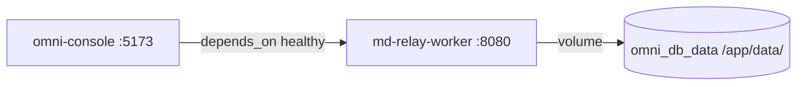

# Local Dev Testing Workflow — Agent Reference

> **Purpose**: This is the canonical reference for running Omni-MD locally using Docker Compose.
> All other workflow docs cross-reference this file for dev environment setup.
>
> **Rule**: Omni-MD uses `docker compose` for **all** local development and testing.
> Do NOT run services individually outside of Docker Compose.

---

## Prerequisites

| Requirement | Check | Fix |
|------------|-------|-----|
| Docker Desktop installed | `docker --version` | [Install Docker Desktop](https://www.docker.com/products/docker-desktop/) |
| Docker Compose v2 | `docker compose version` | Included with Docker Desktop |
| Port 5173 available | `lsof -i :5173` (should be empty) | Kill the process using the port |
| Port 8080 available | `lsof -i :8080` (should be empty) | Kill the process using the port |

---

## Quick Start

```bash
# Clone and start (first time)
cd /Users/ealastre/Documents/GitHub/omni-md
docker compose up -d --build

# Verify
docker compose ps
curl -s http://localhost:8080/api/health/liveness
```

**Access points:**

| Service | URL | Description |
|---------|-----|-------------|
| **Omni-Console UI** | http://localhost:5173 | React dashboard (Nginx serving prod build) |
| **Relay-Worker API** | http://localhost:8080 | Rust backend — webhooks, sync, health |
| **Health Check** | http://localhost:8080/api/health/liveness | K8s-style liveness probe |
| **Readiness Check** | http://localhost:8080/api/health/readiness | DB readiness probe |
| **Sync Logs** | http://localhost:8080/api/logs | Webhook sync event history |

---

## Services

The `docker-compose.yml` defines two services:

| Service | Container Name | Build Context | Port Mapping | Description |
|---------|---------------|---------------|-------------|-------------|
| `omni-console` | `omni-console` | `./omni-console` | `5173:80` | Vite + React dashboard served by Nginx |
| `md-relay-worker` | `md-relay-worker` | `./md-relay-worker` | `8080:8080` | Rust async webhook engine |

### Service Dependencies



- `omni-console` waits for `md-relay-worker` to be healthy before starting
- `md-relay-worker` uses a persistent Docker volume (`omni_db_data`) for SQLite storage
- Both services run with `no-new-privileges` security restriction
- `md-relay-worker` runs as the `genome` user (non-root, compiled into the image)

---

## Common Operations

### Start Everything

```bash
docker compose up -d --build
```

### Stop Everything

```bash
docker compose down
```

### Stop Everything + Wipe Database

```bash
docker compose down -v
```

> ⚠️ The `-v` flag removes the `omni_db_data` volume — all sync event history is lost.

### Rebuild After Code Changes

**Backend (Rust) changes:**
```bash
docker compose build md-relay-worker && docker compose up -d md-relay-worker
```

**Frontend (React) changes:**
```bash
docker compose build omni-console && docker compose up -d omni-console
```

**Full stack rebuild:**
```bash
docker compose up -d --build
```

> ⚠️ **Rust builds are slow** (~1–3 minutes depending on dependencies). The multi-stage Dockerfile caches Cargo dependencies. If only `src/` files changed, the rebuild is faster.

### View Logs

```bash
# All services
docker compose logs -f

# Backend only
docker compose logs -f md-relay-worker

# Frontend only
docker compose logs -f omni-console

# Last 50 lines
docker compose logs md-relay-worker --tail=50
```

### Check Status

```bash
# Container status
docker compose ps

# Health check
curl -s http://localhost:8080/api/health/liveness

# DB readiness
curl -s http://localhost:8080/api/health/readiness | python3 -m json.tool
```

### Clean Reset (Nuclear Option)

Wipe everything and start fresh:

```bash
docker compose down -v --rmi local
docker compose up -d --build
```

This removes:
- All containers
- The `omni_db_data` volume (database)
- Locally built images
- Then rebuilds everything from scratch

---

## Testing Code Changes

### Workflow

```
Edit code → Rebuild affected service → Verify → Repeat
```

### Backend (md-relay-worker)

```bash
# 1. Edit Rust files in md-relay-worker/src/
# 2. Rebuild and restart
docker compose build md-relay-worker && docker compose up -d md-relay-worker

# 3. Verify
curl -s http://localhost:8080/api/health/liveness
docker compose logs md-relay-worker --tail=20
```

### Frontend (omni-console)

```bash
# 1. Edit React/TypeScript files in omni-console/src/
# 2. Rebuild and restart
docker compose build omni-console && docker compose up -d omni-console

# 3. Verify
open http://localhost:5173
```

### Testing Webhooks

```bash
# Send a test webhook payload
curl -X POST http://localhost:8080/webhook \
  -H "Content-Type: application/json" \
  -d '{
    "ref": "refs/heads/main",
    "repository": {
      "full_name": "cmldexter/test-repo",
      "clone_url": "https://github.com/cmldexter/test-repo.git"
    },
    "commits": [
      {
        "message": "docs: update readme",
        "modified": ["docs/README.md"]
      }
    ]
  }'

# Check sync logs
curl -s http://localhost:8080/api/logs | python3 -m json.tool
```

---

## Environment Variables

The `docker-compose.yml` sets these for `md-relay-worker`:

| Variable | Value | Description |
|----------|-------|-------------|
| `DATABASE_URL` | `sqlite:///app/data/omni.db` | SQLite database path inside container |
| `RUST_LOG` | `info` | Log level (options: `error`, `warn`, `info`, `debug`, `trace`) |

To override:

```bash
# Increase logging verbosity
RUST_LOG=debug docker compose up -d md-relay-worker
```

---

## Troubleshooting

### Port Already in Use

```
Error: Bind for 0.0.0.0:8080 failed: port is already allocated
```

**Fix:**
```bash
# Find what's using the port
lsof -i :8080

# Kill it
kill $(lsof -ti :8080)

# Or change the port mapping in docker-compose.yml
```

### Build Failure (Rust)

```
error[E0433]: failed to resolve...
```

**Fix:**
1. Check `Cargo.toml` for missing dependencies
2. Try a clean build: `docker compose build --no-cache md-relay-worker`
3. If cargo cache is corrupted: `docker volume prune` then rebuild

### Health Check Timeout

```
dependency failed to start: container md-relay-worker is unhealthy
```

**Fix:**
1. Check worker logs: `docker compose logs md-relay-worker --tail=50`
2. The health check hits `http://127.0.0.1:8080/api/health/liveness` — if the server crashes on startup, it'll never pass
3. Common causes: missing `DATABASE_URL`, SQLite permission error
4. Nuclear fix: `docker compose down -v && docker compose up -d --build`

### omni-console Shows Blank Page

**Fix:**
1. Check if the worker is healthy: `curl http://localhost:8080/api/health/liveness`
2. Check console logs: `docker compose logs omni-console`
3. The Nginx config proxies API requests to `md-relay-worker:8080` — if the worker is down, API calls fail
4. Rebuild: `docker compose build omni-console && docker compose up -d omni-console`

### Container Keeps Restarting

**Fix:**
```bash
# Check what's happening
docker compose logs md-relay-worker --tail=100

# Common: database file permissions
docker compose down -v && docker compose up -d --build
```

---

## Docker Compose Reference

### Volume

| Volume | Mount | Description |
|--------|-------|-------------|
| `omni_db_data` | `/app/data` (in `md-relay-worker`) | Persistent SQLite storage |

### Network

| Network | Description |
|---------|-------------|
| `omni_net` | Bridge network connecting both services |

### Security

Both services run with:
- `security_opt: no-new-privileges:true` — prevents privilege escalation
- `md-relay-worker` runs as `genome` user (non-root, compiled into the Dockerfile)
- `restart: unless-stopped` — auto-restart on crash (not on manual stop)

---

## Related Docs

| Doc | Path | When to use |
|-----|------|-------------|
| **This Doc** | `docs/local-dev-testing-workflow.md` | Canonical reference for Docker Compose local dev |
| **Dev Database Workflow** | `docs/dev-database-workflow.md` | When inspecting, resetting, or backing up the SQLite dev DB |
| **Epic Worksession** | `docs/epic-worksession-workflow.md` | Start of every focused epic session |
| **Issue Tracker** | `docs/issue-tracker-workflow.md` | For ad-hoc issue work outside epics |
| **Wiki Update** | `docs/wiki-update-workflow.md` | End of session — document what you built |
